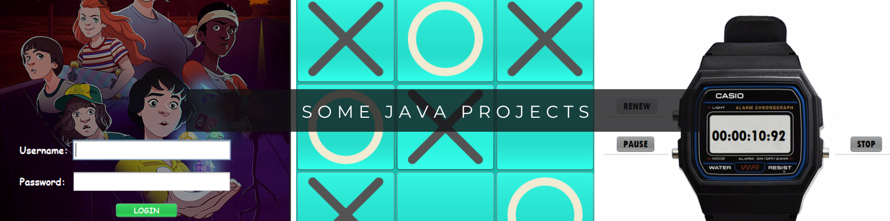

# someJavaProjects

---

> [!NOTE]
> This repository has some `Java` projects in which I have been working with. I worked them using Apache NetBeans but you can also execute them using your favorite IDE or using your dash.

## My favourites

* [Sign Up and Sign in system using a MySQL database](https://github.com/Doisaac/someJavaProjects/tree/main/databases/java-sql/registerOfUsersWithWednesdayTheme)
* [Casio Chronometer](https://github.com/Doisaac/someJavaProjects/tree/main/GUI/casioChronometer)
* [Calculator and Converter](https://github.com/Doisaac/someJavaProjects/tree/main/GUI/calculatorAndConverter)

